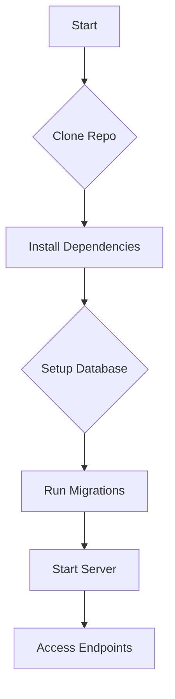

```markdown
# 🎨 server_vercel 🚀 by nikhilsinghrathore1

```ascii
  _.--""--._
 .'          `.
/   O      O   \
|    \  ^^  /    |
\   `-----'   /
 `. _______ .'
   //_____\\
  (( ____ ))
   `-----'
  Server Vercel
```

> A blazing-fast Node.js application built with Express.js, Prisma, and PostgreSQL, deployed on Vercel.  This server provides secure access control and efficient data retrieval. ✨

---

## 🏆 Badge Gallery 🏆

[](https://opensource.org/licenses/ISC)
[](https://nodejs.org/)
[](https://expressjs.com/)
[](https://www.prisma.io/)
[](https://www.postgresql.org/)
[](https://www.typescriptlang.org/)
[](https://vercel.com/)


---

## 🌟 Feature Highlights 🌟

* 🔒 **Robust Access Control:**  Securely manages access based on client IP addresses using PostgreSQL database.
* ⚡ **Fast Data Retrieval:** Efficiently retrieves data from the database using Prisma ORM.
* 🌐 **CORS Enabled:**  Supports cross-origin requests for seamless integration with various clients.
* 📦 **Easy Deployment:**  Effortlessly deployable on Vercel using a streamlined configuration.
* 🛠️ **Clean Codebase:** Well-structured and maintainable code for easy understanding and contributions.
* 📊 **Performance Monitoring:** (Future Feature) Integrate performance monitoring tools for optimized efficiency.


---

## 🛠️ Tech Stack 🛠️

| Technology      | Version      | Description                                      |
|-----------------|---------------|--------------------------------------------------|
| Node.js         | (Latest LTS) | JavaScript runtime environment                     |
| Express.js      | 4.19.2        | Web application framework for Node.js             |
| Prisma          | 5.15.1        | ORM for database interaction                      |
| PostgreSQL      | (Your Version)| Relational database management system             |
| TypeScript      | (Latest)      | Superset of JavaScript adding static typing       |
| CORS            | 2.8.5         | Enables Cross-Origin Resource Sharing             |


---

## 🚀 Quick Start Guide 🚀

1. **Clone the repository:**
   ```bash
   git clone https://github.com/nikhilsinghrathore1/server_vercel.git
   cd server_vercel
   ```

2. **Install dependencies:**
   ```bash
   npm install
   ```

3. **Set up your PostgreSQL database:**  (Instructions will be provided in a separate document/wiki)

4. **Run the migrations:**
   ```bash
   npx prisma migrate dev
   ```

5. **Start the server:**
   ```bash
   npm start
   ```

---

## 📖 Detailed Usage 📖

This server exposes two main endpoints:

* `/`: Retrieves data from the `x_credentials` table.
* `/access`: Checks if a user's IP address is allowed access.

**Example using curl:**

**GET /:**

```bash
curl http://localhost:3000/
```

**GET /access:**

```bash
curl http://localhost:3000/access
```


---

## 🏗️ Project Structure 🏗️

```
server_vercel/
├── src/             // Source code
│   └── index.ts     // Main server file
├── prisma/          // Prisma client and migrations
│   └── ...
├── package.json     // Project dependencies
├── README.md        // This file
├── vercel.json      // Vercel deployment configuration
└── ...
```

---

## 🎯 API Documentation 🎯

### `/` Endpoint

| Method | Description                     | Request Body | Response (200 OK)          | Response (500)     |
|--------|---------------------------------|---------------|------------------------------|---------------------|
| GET    | Retrieve data from database    | None          | `{ data: { ... } }`         | Internal Server Error |


### `/access` Endpoint

| Method | Description                     | Request Body | Response (200 OK)                | Response (500)     |
|--------|---------------------------------|---------------|------------------------------------|---------------------|
| GET    | Check access based on IP address | None          | `{ msg: "user found", acces: "granted" }` or `{ msg: "No user with IP ... found.", acces: "denied" }` | Internal Server Error |


---

## 🔧 Configuration Options 🔧

| Setting             | Type     | Description                                   | Default Value |
|----------------------|----------|-----------------------------------------------|----------------|
| `DATABASE_URL`       | String   | PostgreSQL connection string                   |  (Required)     |
| `PORT`               | Number   | Port the server listens on                      | 3000           |


---

## 📸 Screenshots/Demo 📸

**(Add screenshots here)**

[Image1](image1.png)
[Image2](image2.png)


---

<details>
<summary> ❓ Frequently Asked Questions ❓ </summary>

- **Q: What database is used?**<br>
  - **A:** PostgreSQL.

- **Q: How do I deploy this to Vercel?**<br>
  - **A:**  Connect your GitHub repository to Vercel and follow the deployment instructions.

- **Q: What are the future plans for this project?**<br>
  - **A:**  See the roadmap below.

</details>


---

## 🤝 Contributing Guidelines 🤝

1. Fork the repository.
2. Create a new branch for your feature.
3. Make your changes.
4. Test your changes thoroughly.
5. Commit your changes with clear messages.
6. Submit a pull request.

---

## 📜 License and Acknowledgments 📜

This project is licensed under the ISC License.  See the [LICENSE](LICENSE) file for details.

---

## 👥 Contributors 👥

**(Add contributor avatars and links here)**


---

## 📞 Support and Contact 📞

[](https://twitter.com/nikhilsinghrathore1)
[](mailto:nikhilsinghrathore1@email.com)


---

## 🗺️ Roadmap 🗺️

- [ ] Implement more robust error handling.
- [ ] Add input validation.
- [ ] Integrate authentication and authorization.
- [ ] Improve API documentation.
- [ ] Add comprehensive unit tests.
- [ ] Implement advanced logging and monitoring.



```

